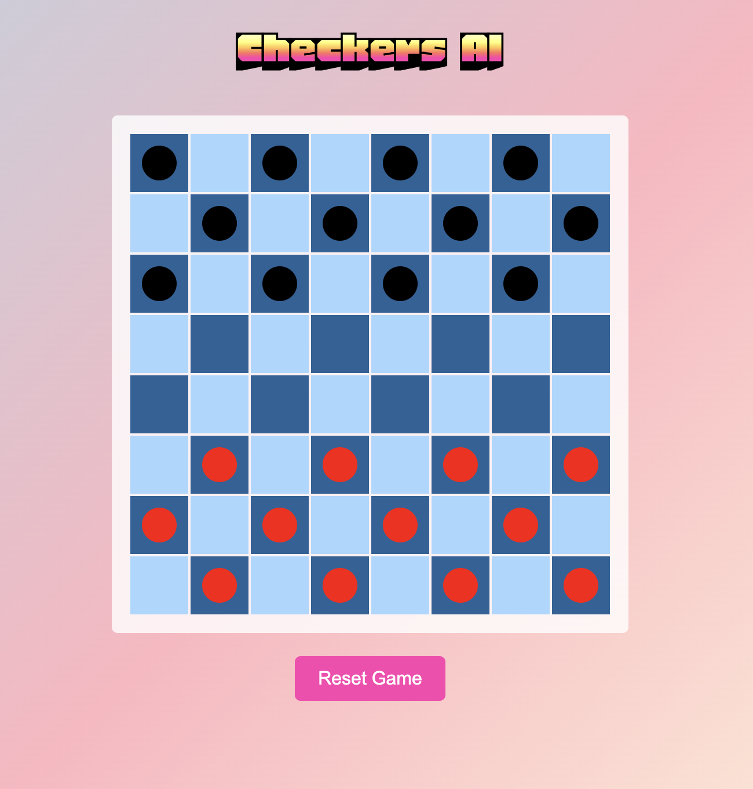

# Checkers Game 🎲

## Overview

This project implements a classic Checkers game with an AI opponent. The AI uses the Minimax algorithm with alpha-beta pruning to make strategic decisions. 🤖

## Features

- **Game Setup**: Initializes a standard 8x8 Checkers board with 12 black and 12 red pieces. 🏁
- **Move Validation**: Ensures that moves are valid according to Checkers rules. ✅
- **AI Player**: Uses the Minimax algorithm with alpha-beta pruning to make optimal moves. 🧠
- **Game Status**: Tracks the number of pieces and determines when the game is over. ⏲️

## How to Run

### Command-Line Version 🖥️

1. Ensure you have Python installed.
2. Run the game: `python main.py` to test it in the terminal. 🕹️

### Web Application 🌐

1. Ensure you have Flask installed: `pip install flask`.
2. Run the web server: `python app.py`.

